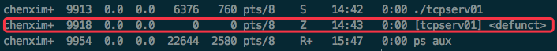
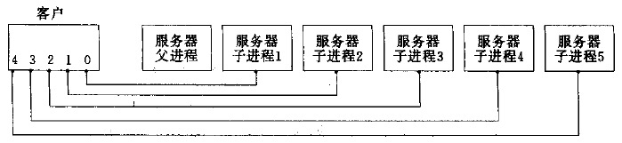
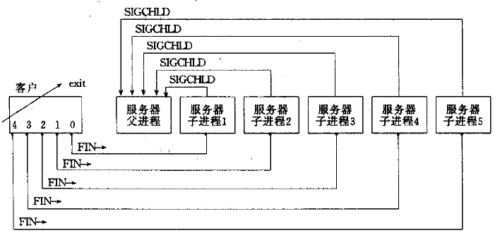
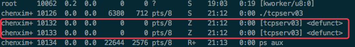
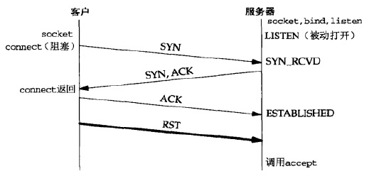
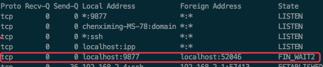
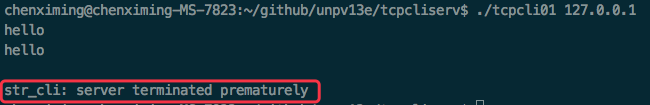

* [1.客户端正常终止](#1客户端正常终止)
    * [1.1 使用wait版sig_chld函数处理子进程SIGCHLD信号](#11-使用wait版sig_chld函数处理子进程sigchld信号)
    * [1.2 使用waitpid版sig_chld函数处理子进程SIGCHLD信号](#12-使用waitpid版sig_chld函数处理子进程sigchld信号)
* [2.accept返回前连接终止](#2accept返回前连接终止)
* [3.服务器子进程终止](#3服务器子进程终止)
	* [3.1 继续对收到RST分节的套接字写](#31-继续对收到RST分节的套接字写)
* [4.服务器主机崩溃](#4服务器主机崩溃)
* [5.服务器主机崩溃后重启](#5服务器主机崩溃后重启)
* [6.服务器主机关机](#6服务器主机关机)

<br>
<br>
<br>

## 1.客户端正常终止

ctrl+d键入EOF，客户端fget返回空指针，str\_cli函数返回，在客户端main函数中继续执行str\_cli之后的指令，通过exit退出

客户端进程终止会关闭进程所有打开的描述符，因此打开的套接字由内核关闭。这会导致客户端发起TCP的4次挥手过程

服务器子进程收到FIN时，readline返回0，导致str_echo函数返回服务器子进程的main函数，调用exit终止：

* 1）子进程打开的所有描述符随之关闭。由子进程来关闭已连接套接字会引发TCP连接终止序列的最后两次挥手；
* 2）子进程终止时，给父进程发生一个SIGCHLD信号，这一版本的服务器没有在代码中捕获这个信号，而该信号的默认行为是被忽略。因此子进程进入僵尸状态

<div align="center">  </div>

> 问题：服务器子进程会变成僵尸进程

### 1.1 使用wait版sig_chld函数处理子进程SIGCHLD信号

在服务器代码listen调用之后增加：

```c
Signal(SIGCHLD,sig_chld);//封装了C函数库的signal函数
```

sig_chld函数如下：

```c
void
sig_chld(int signo)
{
	pid_t	pid;
	int		stat;

	pid = wait(&stat);
	printf("child %d terminated\n", pid);
	return;
}
```

当SIGCHLD信号递交时，父进程阻塞于accept调用。sig_chld函数执行（信号处理函数），其wait调用取到子进程的PID和终止状态，打印信息并返回

**由于信号是在父进程阻塞于慢系统调用(accept)时由父进程捕获的，如果内核不自动重启被中断的系统调用(accept)，内核就会使accept返回一个EINTR错误(被中断的系统调用)。而父进程不能处理该错误，于是终止**（在调用C函数库提供的signal函数时，如果没有设置SA_RESTART标志，有些系统不会重启被中断的系统调用，而有些系统会自动重启被中断的系统调用，这里主要是强调编写捕获信号的网络程序时，必须认清被中断的系统调用且处理它们）

connect不能重启，当connect被一个捕获的信号中断而且不自动重启时，我们必须调用select来等待连接完成

> 问题：服务器父进程accept系统调用被子进程的SIGCHLD信号处理函数中断，返回EINTR错误，父进程无法处理，导致父进程终止  
> 慢系统调用：可能永久阻塞的系统调用。当阻塞于某个慢系统调用的一个进程捕获某个信号且相应信号处理函数返回时，该系统调用可能返回一个EINTR错误。有些内核自动重启某些被中断的系统调用。不过为了便于移植，当我们编写捕获信号的程序时（多数并发服务器捕获SIGCHLD），我们必须对慢系统调用返回EINTR有所准备

### 1.2 使用waitpid版sig_chld函数处理子进程SIGCHLD信号

假设对1.1中的服务器进行了修改，使服务器可以处理系统调用被SIGCHLD信号中断的情况，那么现在的服务器是否已经没有其它问题了？问题在sig_chld函数中的wait调用，它无法处理多个同时到达的SIGCHLD信号

```c
/*******************************************************************
 * 参数：
 *     statloc：子进程的终止状态（可以通过3个宏来检查终止状态，辨别子进程
 *              是正常终止、由某些信号杀死、还是仅仅由作业控制停止）
 *     pid：waitpid可以指定想等待的进程，-1表示等待第一个终止的子进程
 *     options：常用的选项是WNOHANG，它告知内核在没有已终止子进程时不要阻塞
 * 返回：
 *     已终止子进程的进程ID
 * 行为：
 *     wait：wait阻塞到现有子进程第一个终止为止
 *     waitpid：waitpid就等待哪个进程以及是否阻塞给了我们更多的控制
 *******************************************************************/
#include <sys/wait.h>
pid_t wait(int *statloc);
pid_t waitpid(pid_t pid,int *statloc,int options);
```

现在考虑下面的例子：客户端发起5个到服务器的连接，并且仅用第一个连接进行“回射”：

<div align="center">  </div>

当回射结束在终端输入EOF(ctrl+d)时，程序退出，因此5和客户端有关的描述符都将被内核关闭，因此5个连接基本在同一时刻引发5个FIN，这会导致服务器处理5个连接的5个子进程基本在同一时刻终止，因此又导致差不多在同一时刻有5个SIGCHLD信号递交给父进程：

<div align="center">  </div>

看看现在系统上的进程：

<div align="center">  </div>

可以发现，这种情况下，仍然有两个服务器子进程没有得到处理（这个结果是不确定的，依赖于FIN到达服务器主机的时机，信号处理函数可能调用1、2、3次甚至4次），成为了僵尸进程。这是由于Unix信号一般是不排队的（即在信号处理函数调用时到达的信号不排队，如果到达多个，这些信号被解阻塞后，只被递交一次）。解决这个问题的办法是使用waitpid代替wait

```c
void
sig_chld(int signo)
{
	pid_t	pid;
	int		stat;

	//不同于前一个wait版的sig_chld函数，这个版本调用waitpid
	while ( (pid = waitpid(-1, &stat, WNOHANG)) > 0)
		printf("child %d terminated\n", pid);
	return;
}
```

> 问题：wait无法处理多个同时发起的SIGCHLD信号

## 2.accept返回前连接终止

accept返回前连接终止的情况在较忙的服务器（典型的如Web服务器）上已出现过，这种情况如下图所示：

<div align="center">  </div>

三路握手完成从而连接建立之后，客户TCP却发送了一个RST(复位)。在服务器端看来，就在该连接已由TCP排队，等着服务器进程调用accept的时候RST到达。在这之后，服务器进程才调用accept

如何处理这种终止的连接依赖于不同的实现：

* 源自Berkeley的实现完全在内核中处理中止的连接，服务器进程根本看不到
* 大多数SVR4实现返回一个错误给服务器进程，作为accept的返回结果，不过错误本身取决于实现。这些SVR4实现返回一个EPROTO(协议错误)errno值，而POSIX指出返回的errno值必须是ECONNABORTED(软件引起的连接终止)。POSIX作出修改的理由在于：流子系统中发生某些致命的协议相关事件时，也会返回EPROTO。如果返回相同的错误，服务器就不知道是该再次调用accept还是不该了

## 3.服务器子进程终止

假设在客户端与服务器建立起一条连接之后，当客户端调用fget阻塞于控制台输入时，服务器处理客户端请求的子进程被杀死，这个时候客户端会发生什么

<div align="center">  </div>

kill掉服务器子进程后，子进程打开的所有描述符都被关闭。导致向客户发送一个FIN，而客户TCP则响应一个ACK，这就是TCP连接终止工作的前半部分

此时，在客户端上再键入一行文本，客户端输出以下内容后退出：

<div align="center">  </div>

当键入一行新文本时，str_cli调用writen，客户TCP连接把数据发送给服务器。TCP允许这么做。因为客户端TCP接收到FIN只是表示服务器进程已关闭了连接的服务器端，从而不再往其中发送任何数据而已。FIN的接收并没有告诉客户TCP服务器进程已经终止（本例中确实是终止了）

当服务器TCP接收到来自客户的数据时，既然先前打开那个套接字的进程已经关闭，于是响应一个RST（可以使用tcpdump来观察分组，验证该RST确实发送了）

然而客户端进程看不到这个RST，因为它在调用writen后立即调用readline，并且由于前面接收的FIN，所调用的readline立即返回0（表示EOF）。客户端此时并未预期收到EOF，于是以出错消息“serve terminated prematurely”(服务器过早终止)退出（上述讨论还取决于时序。客户端调用readline既可能发生在服务器的RST被客户收到之前，也可能发生在收到之后。如果发生在收到RST之前(如本例所示)，那么结果是客户得到一个未预期的EOF；否则结果是由readline返回一个ECONNRESET(“connection reset by peer”，对方复位连接错误)）

> 问题：当FIN到达套接字时，客户正阻塞在fgets调用上，客户实际上在应对两个描述符——套接字和用户输入，它不能单纯阻塞在这两个源中某个特定源的输入上，而是应该阻塞在任何一个源的输入上，正是select和poll的目的之一

### 3.1 继续对收到RST分节的套接字写

当一个进程向某个已收到RST的套接字执行写操作时（客户可能在读回任何数据之前执行两次针对服务器的写操作），**内核向该进程发送一个SIGPIPE信号。该信号的默认行为是终止进程**，因此进程必须捕获它以免不情愿地被终止

不论进程是捕获了该信号并从其信号处理函数返回，还是简单地忽略该信号，**写操作都将返回EPIPE错误**

```c
//tcpcliserv/str_cli11.c

//这个str_cli函数用来模拟对收到RST分节的套接字进行写
void
str_cli(FILE *fp, int sockfd)
{
	char	sendline[MAXLINE], recvline[MAXLINE];

	while (Fgets(sendline, MAXLINE, fp) != NULL) {

		Writen(sockfd, sendline, 1);
		sleep(1);
		Writen(sockfd, sendline+1, strlen(sendline)-1);

		if (Readline(sockfd, recvline, MAXLINE) == 0)
			err_quit("str_cli: server terminated prematurely");

		Fputs(recvline, stdout);
	}
}
```

## 4.服务器主机崩溃

启动客户端与服务器，并且在客户端键入一行文本确认连接正常工作。然后从网络上断开服务器主机，并在客户端键入另一行文本（这也模拟了当客户发送数据时服务器主机不可达的情形，即建立连接后某些中间路由器不工作）

可以使用tcpdump观察网络，会发现**客户TCP持续重传数据分节，试图从服务器上接收一个ACK**：

* 源自Berkeley的实现重传该数据分节12次，共等待9分钟才放弃重传
 
当客户TCP最后终于放弃时，给客户进程返回一个错误。既然客户阻塞在readline调用上，该调用将返回一个错误。假设服务器主机已崩溃，从而对客户的数据分节根本没有响应，那么所返回的错误是ETIMEDOUT。然而如果某个中间路由器判断服务器主机已不可达，从而响应一个“destination unreachable”(目的地不可达)ICMP消息，那么所返回的错误是EHOSTUNREACH或ENETUNREACH

* **尽管最终会发现服务器已经崩溃或不可达，但是必须等待一个时间，因此需要对readline调用设置一个超时**
* **只有在向服务器主机发送数据时才能检测出它已经崩溃。如果想实现自动检测，需要使用SO_KEEPALIVE套接字选项**

## 5.服务器主机崩溃后重启

和“4.服务器主机崩溃”不同的是，前者是在服务器崩溃时客户端向服务器发送数据，而这里是假设连接建立后，服务器崩溃，然后重启后，客户端再向服务器发送数据（假设客户端套接字并没有使用SO_KEEPALIVE套接字选项，因此在发送数据前，客户端并不知道服务器已经崩溃）

**服务器主机崩溃后重启时，由于它的TCP丢失了崩溃前的所有连接信息，因此服务器TCP对于所收到的来自客户的数据分节响应一个RST。客户TCP收到RST时，正阻塞于readline调用，导致该调用返回ECONNRESET错误**

## 6.服务器主机关机

UNIX系统关机时，init进程通常进行以下操作：

1. 先给所有进程发送SIGTERM信号(能被捕获)
2. 等待一段固定的时间(往往在5到20秒之间)（这么做留给所有运行的进程一小段时间来清除和终止）
3. 给所有仍在运行的进程发送SIGKILL信号(不能被捕获)

如果服务器进程不捕获SIGTERM信号并终止，服务器将由SIGKILL信号终止。当服务器子进程终止时，它的所有打开着的描述符都被关闭，随后发生的步骤与[3.服务器子进程终止](#3服务器子进程终止)一样
