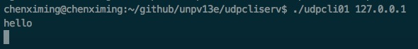
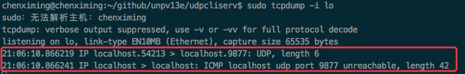

* [1.客户端无法验证收到的数据报](#1客户端无法验证收到的数据报)
    * [1.1 验证收到的数据](#11-验证收到的数据)]
* [2.服务器进程未运行](#2服务器进程未运行) 

<br>
<br>
<br>

## 1.客户端无法验证收到的数据报

v1版本的客户端程序的dg_cli函数调用recvfrom，最后两个参数是NULL，即不关心发送给客户端的数据报来自哪，因此任何进程可以给客户端发送数据报，这些数据报会和服务器正常的回射数据报混杂

### 1.1 验证收到的数据

v2版的dg_cli函数对发送到客户端的数据报的套接字地址结构进行了验证，但是仍然存在问题：如果服务器运行在一个只有单个IP地址的主机上，这个新版本的客户工作正常。然而如果服务器主机是多宿的，客户就有可能失败

假设服务器主机为freebsd4，IP为：

```
host freebsd4
freebsd4.unpbook.com has address 172.24.37.94
freebsd4.unpbook.com has address 135.197.17.100
```

假设客户端指定的服务器ip为 ```135.197.17.100``` ，并且这个服务器IP与客户机不在同一子网（这样指定服务器的IP是允许的。大多数IP实现接收目的地址为主机任一IP地址的数据报，而不管数据报到达的接口，称之为弱端系统模型）

recvfrom返回的IP地址不是发送数据报的目的IP地址。当服务器发送应答时，IP地址是 ```172.24.37.94``` 。主机freebsd4内核中的路由功能为之选择 ```172.24.37.94``` 作为外出接口。因此客户端recvfrom返回的IP和发送数据时指定的IP ```135.135.197.17.100``` 不同，因此识别这个数据报不是来自服务器的数据报，被忽略掉

有下列2个解决办法：

1. 得到由recvfrom返回的IP地址后，客户通过在DNS中查找服务器主机的名字来验证该主机的域名
2. UDP服务器给服务器主机上配置的每个IP地址创建一个套接字，用bind捆绑每个IP地址到各自的套接字，然后在所有这些套接字上使用select，再从可读的套接字给出应答。既然用于给出应答的套接字上绑定的IP地址就是客户请求的目的IP地址，这就保证应答的源地址与请求的目的地址相同

## 2.服务器进程未运行

如果不启动服务器，在客户端键入一行文本后，客户将永远阻塞于recvfrom调用，等待一个永远不出现的服务器应答

启动UDP回射服务器客户端，指定服务器IP为本主机，然后键入hello，由于服务器并没有启动，所以没有回射信息，客户此时阻塞于recvfrom：

<div align="center">  </div>

本地使用tcpdump抓包：

<div align="center">  </div>

从抓取到的数据包可以看出，客户端向localhost的9877号端口发送数据，然后由于相应服务器未启动，所以localhost发送一个ICMP消息，响应目的主机不可达，我们称这个ICMP错误为**异步错误**，该错误由sendto引起，但是sendto本身却成功返回（sendto的成功返回仅仅表示在接口输出队列中具有存放所形成IP数据报的空间）。由于sendto成功返回，但是ICMP错误直到后来才返回，所以称其为异步

从上图可以看出，ICMP消息的目的地并不是客户端（图中并没有指定目的端口）。**对于一个UDP套接字，由它引发的异步错误却并不返回给他，除非它已连接**：

 * 考虑在单个UDP套接字上连续发送3个数据报给3个不同的服务器（即3个不同的IP地址）。该客户随后进入一个调用recvfrom读取应答的循环。其中有2个数据报被正确推送，但是第3个主机没有运行服务器。第三个主机于是以一个ICMP端口不可达错误响应。这个ICMP出错消息包含引起错误的数据报的IP首部和UDP首部。发送这3个数据报的客户需要知道引发该错误的数据报的目的地址以区分究竟是哪一个数据报引发了错误。但是内核如何把该信息返回给客户进程？recvfrom可以返回的信息仅有errno值，它没有办法返回出错数据报的目的IP地址和目的UDP端口号。因此作出决定：仅在进程已将其UDP套接字连接到恰恰一个对端后，这些异步消息才返回给进程