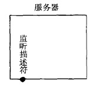
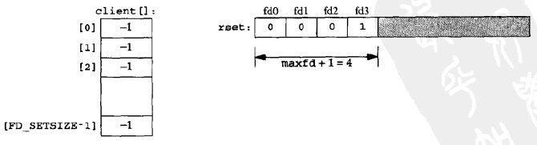
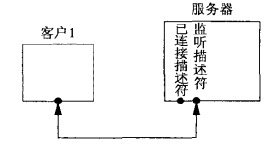
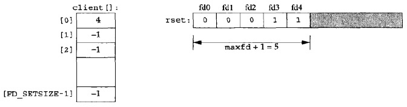
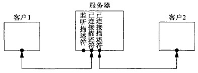
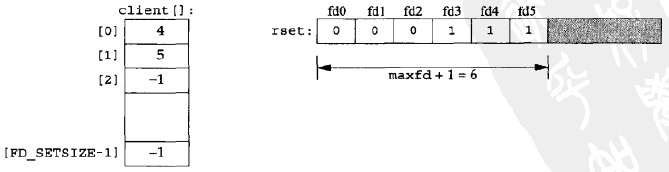
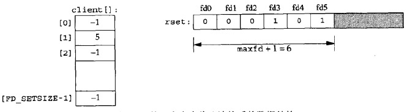

**使用select实现TCP回射服务器，该服务器具有以下特点**：

* **单服务器进程处理所有用户请求**（换而言之非fork）
* **所能处理的最大客户数目的限制是以下两个值中的较小者：**
    - **FD_SETSIZE**
    - **内核允许本进程打开的最大描述符数**

## 服务器状态

client数组记录与客户端通信的描述符，rset是记录客户端描述符的描述符集

#### 1）初始状态

创建监听套接字并在指定地址进行监听

<div align="center">  </div>

client和rset状态如下：

<div align="center">  </div>

#### 2）第一个客户与服务器建立连接时

监听描述符变为可读，服务器于是调用accept。由accept返回的新的已连接描述符将是4

<div align="center">  </div>

client和rset状态如下：

<div align="center">  </div>

#### 3）第二个客户与服务器建立连接时

监听描述符变为可读，服务器于是调用accept。由accept返回的新的已连接描述符将是5

<div align="center">  </div>

client和rset状态如下：

<div align="center">  </div>

#### 4）第一个客户终止与服务器的连接

客户TCP发送一个FIN，使得服务器中的描述符4变为可读、当服务器读这个已连接套接字时，read将返回0。于是关闭该套接字并更新相应的数据结构

<div align="center">  </div>

总之，当有客户到达时，在client数组中的第一个可用项（即值为-1的第一个项）中记录其已连接套接字的描述符。还必须把这个已连接描述符加到读描述符集中

## 代码

tcpcliserv/tcpservselect01.c

```c
/* include fig01 */
#include    "unp.h"

int
main(int argc, char **argv)
{
    int                 i, maxi, maxfd, listenfd, connfd, sockfd;
    int                 nready, client[FD_SETSIZE];
    ssize_t             n;
    fd_set              rset, allset;
    char                buf[MAXLINE];
    socklen_t           clilen;
    struct sockaddr_in  cliaddr, servaddr;

    listenfd = Socket(AF_INET, SOCK_STREAM, 0);

    bzero(&servaddr, sizeof(servaddr));
    servaddr.sin_family      = AF_INET;
    servaddr.sin_addr.s_addr = htonl(INADDR_ANY);
    servaddr.sin_port        = htons(SERV_PORT);

    Bind(listenfd, (SA *) &servaddr, sizeof(servaddr));

    Listen(listenfd, LISTENQ);

    maxfd = listenfd;           /* initialize */
    maxi = -1;                  /* index into client[] array */
    for (i = 0; i < FD_SETSIZE; i++)
        client[i] = -1;         /* -1 indicates available entry */
    FD_ZERO(&allset);
    FD_SET(listenfd, &allset);
/* end fig01 */

/* include fig02 */
    for ( ; ; ) {
        rset = allset;      /* structure assignment */
        nready = Select(maxfd+1, &rset, NULL, NULL, NULL);

        if (FD_ISSET(listenfd, &rset)) {    /* new client connection */
            clilen = sizeof(cliaddr);
            connfd = Accept(listenfd, (SA *) &cliaddr, &clilen);
#ifdef  NOTDEF
            printf("new client: %s, port %d\n",
                    Inet_ntop(AF_INET, &cliaddr.sin_addr, 4, NULL),
                    ntohs(cliaddr.sin_port));
#endif

            for (i = 0; i < FD_SETSIZE; i++)
                if (client[i] < 0) {
                    client[i] = connfd; /* save descriptor */
                    break;
                }
            if (i == FD_SETSIZE)
                err_quit("too many clients");

            FD_SET(connfd, &allset);    /* add new descriptor to set */
            if (connfd > maxfd)
                maxfd = connfd;         /* for select */
            if (i > maxi)
                maxi = i;               /* max index in client[] array */

            if (--nready <= 0)
                continue;               /* no more readable descriptors */
        }

        for (i = 0; i <= maxi; i++) {   /* check all clients for data */
            if ( (sockfd = client[i]) < 0)
                continue;
            if (FD_ISSET(sockfd, &rset)) {
                if ( (n = Read(sockfd, buf, MAXLINE)) == 0) {
                        /*4connection closed by client */
                    Close(sockfd);
                    FD_CLR(sockfd, &allset);
                    client[i] = -1;
                } else
                    Writen(sockfd, buf, n);

                if (--nready <= 0)
                    break;              /* no more readable descriptors */
            }
        }
    }
}
/* end fig02 */
```